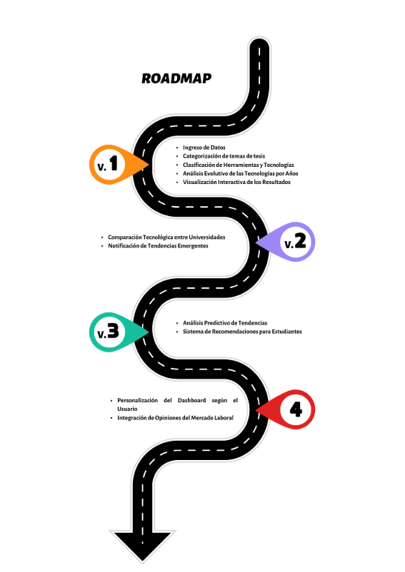

` `                                                                                                                                 ![C:\Users\EPIS\Documents\upt.png]

![C:\Users\EPIS\Documents\upt.png]

**UNIVERSIDAD PRIVADA DE TACNA**

**FACULTAD DE INGENIERÍA**

**Escuela Profesional de Ingeniería de Sistemas**

***“*Análisis de las herramientas y tecnologías utilizadas en las tesis de grado de Ingeniería de Sistemas en universidades del Perú*”***

Curso: *Inteligencia de Negocios*

Docente: *Ing. Patrick Cuadros*

Integrantes:

***Ayma Choque, Erick Yoel (2021072616)***

***Poma Machicado, Fabiola Estefani (2021070030)***

***Tapia Vargas, Dylan Yariet (2021072630)***

**Tacna – Perú**

***2025***

|CONTROL DE VERSIONES||||||
| :-: | :- | :- | :- | :- | :- |
|Versión|Hecha por|Revisada por|Aprobada por|Fecha|Motivo|
|1\.0|MPV|PC|PC|17/03/2025|Versión Original|

Análisis de las herramientas y tecnologías utilizadas en las tesis de grado de Ingeniería de Sistemas en universidades del Perú

Documento de Visión

Versión *{1.0}*

|CONTROL DE VERSIONES||||||
| :-: | :- | :- | :- | :- | :- |
|Versión|Hecha por|Revisada por|Aprobada por|Fecha|Motivo|
|1\.0|MPV|ELV|ARV|10/10/2025|Versión Original|

**ÍNDICE GENERAL**

[**1. Introducción	4**](#_heading=h.vwvmcnb0dc5k)**

[1.1. Propósito	4](#_heading=h.d68sm4vkyttv)

[1.2. Alcance	4](#_heading=h.mj1mzzg51ya7)

[1.3. Definiciones, Siglas y Abreviaturas	5](#_heading=h.va2wlj9tb3k)

[1.4. Referencias	5](#_heading=h.5t0f3tnzoc8m)

[1.5. Visión General	5](#_heading=h.rlabxw6mjrm)

[**2. Posicionamiento	5**](#_heading=h.n5nb5tmwtkb1)

[2.1. Oportunidad de negocio	5](#_heading=h.11zi2vvsp2p)

[2.2. Definición del problema	5](#_heading=h.jmkit8uak4gw)

[**3. Descripción de los interesados y usuarios	6**](#_heading=h.1b0ujhmiuexs)

[3.1. Resumen de los interesados	6](#_heading=h.uwqfz9k4rp8w)

[3.2. Resumen de los usuarios	6](#_heading=h.ixt6d34q2t3z)

[3.3. Entorno de usuario	6](#_heading=h.dfv0qi2yui0j)

[3.4. Perfiles de los interesados	7](#_heading=h.y5n60jlzy55l)

[3.5. Perfiles de los Usuarios	8](#_heading=h.bfzkayxv41jy)

[3.6. Necesidades de los interesados y usuarios	8](#_heading=h.vd80z8dpbdea)

[**4. Vista General del Producto	10**](#_heading=h.1l2wh48zue5b)

[4.1. Perspectiva del producto	10](#_heading=h.wgikvtip19gl)

[4.2. Resumen de capacidades	10](#_heading=h.xa4g8g7wd8su)

[4.3. Suposiciones y dependencias	10](#_heading=h.8vrcivnlbln3)

[4.4. Costos y precios	10](#_heading=h.dsx1yxvqap4i)

[4.5. Licenciamiento e instalación	11](#_heading=h.dcw3tjac4bwz)

[**5. Características del producto	11**](#_heading=h.m6wj7qtgxsnh)

[**6. Restricciones	11**](#_heading=h.eg83dhaoew7)

[**7. Rangos de calidad	11**](#_heading=h.kb5g7wwo08ga)

[**8. Precedencia y Prioridad	12**](#_heading=h.4fx0ix1xc07f)

[**9. Otros requerimientos del producto	12**](#_heading=h.a2a2fph91gxi)

[9.1. Estándares legales	12](#_heading=h.mlky84k81oq9)

[9.2. Estándares de comunicación	12](#_heading=h.25s2a4rt038z)

[9.3. Estándares de cumplimiento de la plataforma	12](#_heading=h.lrzz6z47p8bz)

[9.4. Estándares de calidad y seguridad	12](#_heading=h.vwv5qsbwqmiy)

[**10. Conclusiones	12**](#_heading=h.su9covufwqpb)

[**11. Recomendaciones	13**](#_heading=h.bxudbmim0vav)

[**12. Bibliografía	13**](#_heading=h.73xhlfkn15r1)

1. # Introducción
   El avance tecnológico y la constante evolución del sector de Ingeniería de Sistemas exigen que los estudiantes y profesionales se mantengan actualizados con las herramientas y tecnologías más utilizadas en la industria. Las universidades juegan un papel clave en la formación de futuros ingenieros, y sus programas académicos deben estar alineados con las tendencias del mercado laboral.

   Sin embargo, en el contexto peruano, no existe un estudio sistemático que analice qué herramientas y tecnologías se emplean en las tesis de grado de Ingeniería de Sistemas en las principales universidades del país. Esto dificulta la identificación de tendencias y la adaptación de los programas de estudio para mejorar la empleabilidad de los egresados.

   Este trabajo tiene como objetivo analizar las herramientas y tecnologías utilizadas en tesis de universidades destacadas del Perú. A través de este estudio, se busca generar información valiosa que sirva como referencia tanto para estudiantes que desean conocer qué tecnologías dominar, como para docentes y gestores académicos que buscan actualizar los planes de estudio conforme a las demandas del sector tecnológico.

   1. ## Propósito
      El propósito de este estudio es identificar y analizar las herramientas y tecnologías utilizadas en las tesis de grado de las principales universidades de Ingeniería de Sistemas del Perú. A través de este análisis, se busca proporcionar información relevante que permita a estudiantes, docentes y autoridades académicas comprender las tendencias tecnológicas en el ámbito universitario y su relación con las demandas del mercado laboral.

      Este estudio servirá como base para la toma de decisiones en la actualización de programas académicos, ayudando a mejorar la formación de los futuros profesionales en Ingeniería de Sistemas y fortaleciendo su empleabilidad en un entorno tecnológico en constante evolución.
   1. ## Alcance
      Este estudio abarca el análisis de las herramientas y tecnologías utilizadas en las tesis de grado de las principales universidades de Ingeniería de Sistemas en el Perú hasta la fecha.

      El análisis incluirá:

      La identificación de las herramientas tecnológicas más utilizadas en las tesis, como lenguajes de programación, bases de datos, frameworks, metodologías de desarrollo y otras tecnologías relevantes.

- La clasificación de dichas herramientas por categoría y su evolución a lo largo del tiempo.
- La recopilación de información de universidades reconocidas a nivel nacional con programas de Ingeniería de Sistemas.
- La generación de un análisis visual e interactivo que facilite la interpretación de los datos obtenidos.
  1. ## Definiciones, Siglas y Abreviaturas
     Tesis de grado: Trabajo de investigación realizado por estudiantes universitarios como requisito para obtener un título profesional.

     Framework: Conjunto de herramientas y bibliotecas que facilitan el desarrollo de software al proporcionar una estructura predefinida.

     Lenguaje de programación: Conjunto de reglas y sintaxis utilizadas para escribir programas de software, como Java, Python o C++.

     BD: Sistema que permite el almacenamiento, gestión y recuperación de información estructurada. Ejemplos: MySQL, PostgreSQL, MongoDB.

     IA: Rama de la informática que busca desarrollar sistemas capaces de realizar tareas que requieren inteligencia humana.

     TI: Conjunto de tecnologías utilizadas para gestionar y procesar información digitalmente.

     ##

  1. ## Visión General
     Este proyecto analiza las herramientas y tecnologías utilizadas en las tesis de grado de Ingeniería de Sistemas en universidades peruanas. Su objetivo es identificar tendencias tecnológicas para mejorar la formación académica y la empleabilidad de los egresados. Los resultados ayudarán a estudiantes, docentes y autoridades a alinear los programas de estudio con las demandas del mercado.
1. # Posicionamiento
   1. ## Oportunidad de negocio

   1. ## Definición del problema
      El avance tecnológico en Ingeniería de Sistemas requiere que estudiantes y universidades se mantengan actualizados. Sin embargo, no existe un estudio sistemático que identifique las herramientas y tecnologías más utilizadas en las tesis de grado de las principales universidades del Perú, lo que genera una desconexión entre la formación académica y las necesidades del mercado laboral.

      Los estudiantes carecen de información sobre qué tecnologías dominar para mejorar su empleabilidad, mientras que las universidades tienen dificultades para actualizar sus programas académicos sin datos concretos. Asimismo, los docentes e investigadores no cuentan con un análisis que les permita evaluar el impacto y la evolución de estas herramientas a lo largo del tiempo.

      Ante esta situación, es necesario un estudio detallado que identifique y analice las tecnologías predominantes en las tesis, con el fin de optimizar la formación académica y alinear mejor la educación superior con las demandas del sector tecnológico.

1. # Descripción de los interesados y usuarios
   1. ## Resumen de los interesados
      El estudio sobre las herramientas y tecnologías en las tesis de grado de Ingeniería de Sistemas en el Perú busca cerrar la brecha entre la formación académica y las demandas del mercado laboral. Actualmente, no existe un análisis sistemático de las tecnologías más utilizadas en las investigaciones universitarias, lo que dificulta la actualización curricular. El estudio beneficiará a estudiantes, docentes, investigadores, universidades y empresas tecnológicas, mejorando la preparación profesional y la calidad educativa. 
   1. ## Resumen de los usuarios
- Estudiantes de Ingeniería de Sistemas: Utilizarán el análisis para conocer las tecnologías más empleadas en las tesis y así enfocar su aprendizaje en herramientas con mayor relevancia en el mercado laboral.
- Docentes e Investigadores: Se apoyarán en los resultados del estudio para guiar a los estudiantes en la selección de tecnologías y fortalecer la calidad de los trabajos de investigación.
- Administradores Académicos y Universidades: Usarán el análisis para actualizar sus programas de estudio y mejorar la alineación con las tendencias tecnológicas.
- Empresas del Sector Tecnológico: Podrán identificar tecnologías emergentes y evaluar la preparación de los egresados en función de las herramientas utilizadas en sus tesis.

  1. ## Entorno de usuario

- Plataforma de Acceso: Los usuarios podrán consultar los resultados del estudio a través de una interfaz digital, como una página web o aplicación, que les permita explorar datos de manera interactiva.
- Formato de Presentación: La información se presentará en gráficos, tablas y visualizaciones dinámicas para facilitar la interpretación de tendencias y patrones en el uso de tecnologías en las tesis de grado.
- Accesibilidad: El sistema debe ser intuitivo y accesible desde distintos dispositivos (computadoras, tablets, smartphones) para garantizar su disponibilidad a estudiantes, docentes, investigadores y empresas.
- Actualización de Datos: Se planea una actualización periódica para reflejar cambios en las tendencias tecnológicas y garantizar que la información sea relevante y útil a lo largo del tiempo.

Este entorno permitirá a los usuarios analizar, comparar y extraer conclusiones sobre la evolución de las herramientas tecnológicas en la formación en Ingeniería de Sistemas en el Perú.

1. ## Perfiles de los interesados
   Estudiantes de Ingeniería de Sistemas

- Perfil: Jóvenes en proceso de formación académica, interesados en conocer las herramientas y tecnologías más utilizadas en el ámbito universitario y profesional.
- Intereses: Identificar tecnologías relevantes para su formación y mejorar su empleabilidad.
- Beneficio: Acceso a información clave para orientar su aprendizaje y elegir herramientas con mayor demanda en el mercado.

Docentes e Investigadores

- Perfil: Profesionales dedicados a la enseñanza y la investigación en Ingeniería de Sistemas, responsables de guiar a los estudiantes en sus proyectos académicos.
- Intereses: Conocer las tendencias tecnológicas en tesis de grado para mejorar la orientación de sus alumnos y desarrollar investigaciones alineadas con el avance del sector.
- Beneficio: Disponer de datos actualizados para mejorar la calidad de la enseñanza y fomentar el uso de tecnologías con mayor impacto.

Administradores Académicos y Universidades

- Perfil: Directores, coordinadores y diseñadores de programas educativos en facultades de Ingeniería de Sistemas.
- Intereses: Actualizar los planes de estudio en función de las tecnologías más utilizadas en las tesis de grado.
- Beneficio: Contar con información precisa para ajustar la enseñanza a las necesidades del mercado y mejorar la competitividad de la universidad.

Empresas del Sector Tecnológico

- Perfil: Empresas de software, consultoras tecnológicas y reclutadores en busca de talento con conocimientos en herramientas actuales.
- Intereses: Identificar las tecnologías emergentes en la formación universitaria y evaluar la preparación de los egresados.
- Beneficio: Mejor selección de candidatos y anticipación a las tendencias tecnológicas del mercado.

  1. ## Perfiles de los Usuarios
- Estudiantes: Se beneficiarán al conocer las tecnologías más utilizadas en investigaciones recientes, lo que les permitirá orientar mejor su aprendizaje y fortalecer su perfil profesional según las tendencias del mercado.
- Docentes e Investigadores: Contarán con información relevante para guiar a los estudiantes en la selección de herramientas tecnológicas, además de facilitar la alineación de sus proyectos con las necesidades del sector.
- Universidades y Facultades de Ingeniería de Sistemas: Podrán utilizar los hallazgos del estudio para actualizar sus planes de estudio, asegurando que la formación académica esté alineada con la evolución tecnológica y las exigencias del mercado laboral.
- Empresas y el Sector Tecnológico: Tendrán acceso a datos sobre las tendencias académicas en tecnologías, lo que les permitirá identificar talentos mejor preparados y comprender qué herramientas están siendo adoptadas en el ámbito universitario.

Este análisis facilitará la toma de decisiones informadas para mejorar la formación en Ingeniería de Sistemas y fortalecer la relación entre la educación superior y el mercado laboral.
1. ## Necesidades de los interesados y usuarios
   Los interesados y usuarios del estudio tienen diferentes necesidades según su rol dentro del ecosistema académico y profesional de Ingeniería de Sistemas. A continuación, se detallan sus principales requerimientos:

   **Necesidades de los Interesados**

   Estudiantes:

- Identificar las herramientas y tecnologías más relevantes para mejorar su empleabilidad.
- Acceder a información actualizada y estructurada sobre tendencias tecnológicas en tesis.
- Contar con una plataforma accesible para explorar datos de forma sencilla e intuitiva.

Docentes e Investigadores:

- Conocer las tecnologías predominantes en la investigación académica para orientar mejor a sus estudiantes.
- Acceder a reportes detallados para mejorar la enseñanza y la producción científica.
- Identificar tendencias emergentes para desarrollar nuevos proyectos de investigación.

Administradores Académicos y Universidades:

- Evaluar y actualizar los planes de estudio en función de las tendencias tecnológicas.
- Disponer de un análisis claro que facilite la toma de decisiones estratégicas en la educación superior.
- Fortalecer la vinculación entre la universidad y el sector tecnológico para mejorar la empleabilidad de los egresados.

Empresas del Sector Tecnológico:

- Identificar qué tecnologías se están enseñando en las universidades para alinear sus procesos de selección.
- Conocer tendencias en formación para desarrollar estrategias de capacitación interna.
- Facilitar la búsqueda de talento con conocimientos en herramientas de alta demanda en el mercado laboral.

**Necesidades de los Usuarios**

Usuario Estudiante:

- Acceder a una plataforma interactiva que le permita explorar tecnologías utilizadas en tesis de forma sencilla.
- Obtener datos visuales y estructurados que faciliten la comprensión de tendencias tecnológicas.
- Contar con opciones de búsqueda y filtrado para analizar información específica por universidad o año.

Usuario Docente/Investigador:

- Tener acceso a informes detallados sobre la evolución del uso de tecnologías en tesis.
- Poder comparar tendencias entre universidades y años para fortalecer la enseñanza y la investigación.
- Recibir recomendaciones basadas en datos para guiar a los estudiantes en la selección de herramientas tecnológicas.

Usuario Administrador Académico:

- Disponer de reportes estratégicos para actualizar programas de estudio y mejorar la oferta educativa.
- Acceder a datos de manera estructurada con gráficos y métricas relevantes para la planificación curricular.

Usuario Empresarial:

- Obtener información sobre las tecnologías que dominan los egresados para mejorar la selección de talento.
- Analizar tendencias en formación universitaria para anticipar necesidades del mercado.
- Acceder a reportes personalizados que le permitan evaluar qué universidades están alineadas con las demandas del sector.

Este estudio busca atender estas necesidades a través de una plataforma de análisis accesible, con herramientas interactivas y funcionalidades avanzadas que faciliten el acceso a información clave para la educación y la industria tecnológica.
1. # Vista General del Producto
   1. ## Perspectiva del producto
      El producto se posiciona como una herramienta clave para mejorar la toma de decisiones en el ámbito académico y profesional dentro del sector de Ingeniería de Sistemas.

      Se espera que este análisis impulse la modernización de los programas educativos en las universidades, alinee la formación de los estudiantes con las necesidades del mercado y facilite a las empresas la identificación de talento con conocimientos en tecnologías emergentes.
   1. ## Resumen de capacidades
1. Recopilación y análisis de datos:
- Extracción y procesamiento de información de tesis de grado.
- Clasificación de tecnologías utilizadas (lenguajes de programación, frameworks, bases de datos, metodologías, etc.).
1. Visualización interactiva:
- Panel de control con gráficos dinámicos y estadísticas sobre tendencias tecnológicas.
- Filtros por universidad, año y categoría tecnológica.
1. Funciones avanzadas:
- Exportación de datos en formatos como CSV y PDF.
  1. ## Suposiciones y dependencias
     Para el correcto desarrollo y funcionamiento del producto, se establecen las siguientes suposiciones y dependencias:

     Disponibilidad de datos: Se asume que las universidades cuentan con repositorios de tesis accesibles públicamente o bajo acuerdos institucionales.

     Acceso a tecnologías de análisis de datos: El sistema dependerá de herramientas de procesamiento y visualización de Power BI.

  1. ## Costos y precios
     El proyecto contempla distintos modelos de acceso y costos según los usuarios:

1. Acceso gratuito:
- Consulta básica de tendencias y estadísticas generales.
- Visualización limitada de datos y gráficos.
1. Modelo de suscripción premium:
- Acceso completo a todos los datos históricos y filtros avanzados.
- Exportación de reportes en formatos editables.
- Costo estimado: $10 - $50 mensuales, dependiendo del nivel de acceso.
1. Planes institucionales para universidades y empresas:
- Acceso multiusuario para análisis académico o reclutamiento.
- Personalización de paneles de datos según necesidades específicas.
- Costo a negociar según volumen de usuarios y requerimientos especiales.
  1. ## Licenciamiento e instalación
1. Licenciamiento:
- El producto funcionará bajo un modelo de Software como Servicio (SaaS), con licencias anuales o mensuales según el nivel de acceso.
- Los usuarios gratuitos podrán acceder a una versión limitada sin necesidad de instalación.
- Se considerará la posibilidad de ofrecer licencias educativas gratuitas para universidades públicas.
1. Instalación y acceso:
- La plataforma estará disponible en la web, sin necesidad de descarga.
- Para usuarios institucionales, se podrá ofrecer integración con sistemas de gestión académica existentes.
- Se garantizará la compatibilidad con navegadores modernos y dispositivos móviles.
1. # Características del producto
   El producto tendrá las siguientes características clave que le permitirán cumplir con los objetivos del estudio:

- **Interfaz de Usuario Amigable**: Una plataforma fácil de usar para facilitar el acceso a los resultados y facilitar la visualización de tendencias tecnológicas.
- **Búsqueda Avanzada**: Herramientas de búsqueda por año, universidad, tipo de tecnología o herramienta específica utilizada en las tesis.
- **Reportes Interactivos**: Capacidad de generar gráficos, tablas y análisis interactivos sobre las herramientas y tecnologías utilizadas en las tesis.
- **Exportación de Datos**: Opción para exportar los resultados en formatos como PDF, CSV o Excel para análisis más detallados.
1. # Restricciones

1. # Rangos de calidad
- Precisión de Datos: La precisión en la recopilación de datos de las tesis debe ser alta para garantizar que las tendencias reflejadas sean correctas y representativas del uso real de las tecnologías.
- Velocidad de Acceso: El tiempo de respuesta de la plataforma debe ser rápido, especialmente cuando se consultan grandes volúmenes de datos. Se requiere una infraestructura adecuada para soportar el acceso masivo de usuarios.
- Usabilidad: La interfaz debe ser intuitiva y fácil de navegar para garantizar que los usuarios, independientemente de su perfil, puedan utilizar la plataforma de manera eficiente.

1. # Precedencia y Prioridad
- Accesibilidad de Datos: La recopilación de datos de tesis debe ser la primera prioridad para asegurar que el análisis se base en una muestra representativa de los trabajos de grado en las universidades seleccionadas.
- Desarrollo de la Plataforma: Una vez que los datos se hayan recolectado, la creación de la plataforma de acceso será prioritaria. Se asegurará que la visualización y los filtros sean accesibles desde distintos dispositivos y plataformas.
- Pruebas y Retroalimentación: Se realizarán pruebas piloto del sistema con usuarios clave (estudiantes, docentes, y administradores académicos) para validar las funcionalidades y la efectividad de las herramientas interactivas.

1. # Otros requerimientos del producto
   1. ## Estándares legales
      El producto debe cumplir con las leyes de protección de datos personales y propiedad intelectual, especialmente si los datos de las tesis contienen información sensible.
   1. ## Estándares de comunicación
      Se garantizará que la plataforma sea accesible para personas con discapacidades, siguiendo los estándares de accesibilidad web (WCAG 2.0).
   1. ## Estándares de cumplimiento de la plataforma
      La plataforma debe ser compatible con los principales navegadores web (Chrome, Firefox, Safari, Edge) y dispositivos móviles para garantizar una amplia accesibilidad.
   1. ## Estándares de calidad y seguridad
      La plataforma deberá contar con medidas de seguridad adecuadas, incluyendo el cifrado de datos, autenticación de usuarios y protección contra accesos no autorizados.
1. # Conclusiones
   Este estudio permitirá obtener una visión clara de las tendencias tecnológicas utilizadas en las tesis de grado en Ingeniería de Sistemas en las principales universidades del Perú. Al proporcionar datos precisos y accesibles, el proyecto tiene el potencial de mejorar la calidad de la formación académica y la alineación de los programas educativos con las necesidades del mercado laboral. Además, se proporcionará a los estudiantes, docentes y empresas información valiosa para tomar decisiones informadas sobre qué tecnologías dominar y qué herramientas utilizar.
1. # Recomendaciones
- **Actualización Continua**: Se recomienda que el sistema sea actualizado periódicamente con nuevos datos para reflejar las tendencias más recientes en el uso de tecnologías.
- **Ampliación a Otras Especialidades**: Considerar la posibilidad de extender este estudio a otras áreas de la ingeniería, como la ingeniería de software, la ingeniería electrónica y la ingeniería industrial, para obtener un panorama más amplio.
- **Colaboración con Universidades**: Fomentar la colaboración con más universidades y centros de investigación para ampliar la base de datos y hacer el análisis más representativo a nivel nacional.
1. # Bibliografía
roadmap

[C:\Users\EPIS\Documents\upt.png]: Recursos/Aspose.Words.b88fde64-e381-4c53-9c65-03fa104b58f1.002.png
[C:\Users\EPIS\Documents\upt.png]: Recursos/Aspose.Words.b88fde64-e381-4c53-9c65-03fa104b58f1.003.png
